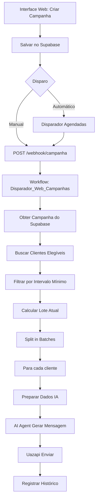

# Guia Completo: Sistema de Campanhas - Do Cadastro ao Envio

Este guia explica **todo o fluxo** do sistema de campanhas, desde o cadastro na interface web até o envio das mensagens via WhatsApp.

## 🎯 Resumo Rápido

**Fluxo Completo em 3 Passos:**

1. **Cadastro:** Interface web → Salva no Supabase (`instacar_campanhas`)
2. **Disparo:** Webhook → Workflow busca dados da campanha do Supabase
3. **Processamento:** Workflow usa dados da campanha (prompt, limites, etc.) para gerar e enviar mensagens

**Onde está cada coisa:**

- **Dados da campanha:** Tabela `instacar_campanhas` no Supabase
- **Agente IA:** Workflow `Disparador_Web_Campanhas_Instacar.json` (nó "Preparar Dados IA Campanha" + nós de IA a serem adicionados)
- **Agendamento Cron:** Campo `agendamento_cron` na campanha + Workflow `Disparador_Campanhas_Agendadas.json`

## 📋 Índice

1. [Cadastro de Campanha na Interface Web](#1-cadastro-de-campanha-na-interface-web)
2. [Como o Workflow Recebe os Dados](#2-como-o-workflow-recebe-os-dados)
3. [Agendamento Cron - Como Funciona](#3-agendamento-cron---como-funciona)
4. [Agente IA - Onde Está e Como Funciona](#4-agente-ia---onde-está-e-como-funciona)
5. [Exemplo Prático: Campanha de Natal/Ano Novo](#5-exemplo-prático-campanha-de-natalano-novo)

---

## 1. Cadastro de Campanha na Interface Web

### 1.1 Campos do Formulário

Quando você cria uma campanha na interface web, os seguintes dados são salvos no Supabase:

| Campo                         | Tipo    | Descrição                               | Exemplo                             |
| ----------------------------- | ------- | --------------------------------------- | ----------------------------------- |
| **nome**                      | TEXT    | Nome da campanha                        | "Natal e Ano Novo 2025"             |
| **periodo_ano**               | TEXT    | Período/época                           | `"natal"` ou `"ano-novo"`           |
| **data_inicio**               | DATE    | Data de início                          | `2025-12-01`                        |
| **data_fim**                  | DATE    | Data de fim                             | `2026-01-05`                        |
| **limite_envios_dia**         | INTEGER | Máximo de mensagens por dia             | `200`                               |
| **intervalo_envios_segundos** | INTEGER | Intervalo fixo entre envios (opcional)  | `130` ou `NULL` (aleatorizado)      |
| **whatsapp_api_id**           | UUID    | ID da instância Uazapi                  | UUID da instância selecionada       |
| **agendamento_cron**          | TEXT    | Expressão cron para execução automática | `"0 9 1 1 *"` (1º de janeiro às 9h) |
| **prompt_ia**                 | TEXT    | Prompt personalizado para a IA          | "Deseje um Feliz Natal..."          |
| **tamanho_lote**              | INTEGER | Clientes por execução                   | `50`                                |
| **horario_inicio**            | TIME    | Horário de início                       | `"09:00:00"`                        |
| **horario_fim**               | TIME    | Horário de fim                          | `"18:00:00"`                        |
| **usar_veiculos**             | BOOLEAN | Incluir dados de veículos               | `false` (para Natal genérico)       |
| **usar_vendedor**             | BOOLEAN | Incluir nome do vendedor                | `false`                             |

### 1.2 Processo de Salvamento

```javascript
// interface-web/app.js - função salvarCampanha()

const dados = {
  nome: "Natal e Ano Novo 2025",
  periodo_ano: "natal",
  data_inicio: "2025-12-01",
  data_fim: "2026-01-05",
  limite_envios_dia: 200,
  intervalo_envios_segundos: null, // Aleatorizado 130-150s
  whatsapp_api_id: "uuid-da-instancia",
  agendamento_cron: "0 9 1 1 *", // 1º de janeiro às 9h
  prompt_ia: "Deseje um Feliz Natal e um Próspero Ano Novo...",
  tamanho_lote: 50,
  horario_inicio: "09:00:00",
  horario_fim: "18:00:00",
  usar_veiculos: false, // Não mencionar veículos
  usar_vendedor: false, // Não mencionar vendedor
};

// Salva no Supabase
await supabaseClient.from("instacar_campanhas").insert([dados]);
```

**Onde os dados ficam:** Tabela `instacar_campanhas` no Supabase

---

## 2. Como o Workflow Recebe os Dados

## 2. Como o Workflow Recebe os Dados

### 2.1 Fluxo de Recebimento

```text
Interface Web (disparo manual)
    ↓
POST /webhook/campanha
    ↓
{ campanha_id: "uuid" }
    ↓
Workflow: Disparador_Web_Campanhas_Instacar
    ↓
Nó: "Validar Payload"
    ↓
Nó: "Obter Campanha" (Supabase)
    ↓
✅ Todos os dados da campanha disponíveis
```

### 2.2 Nó: "Obter Campanha"

**Localização:** Após validações iniciais

**Código do Nó:**

```json
{
  "operation": "getAll",
  "tableId": "instacar_campanhas",
  "filters": {
    "conditions": [
      {
        "keyName": "id",
        "condition": "eq",
        "keyValue": "={{ $json.campanha_id }}"
      },
      {
        "keyName": "status",
        "condition": "eq",
        "keyValue": "ativa"
      },
      {
        "keyName": "ativo",
        "condition": "eq",
        "keyValue": true
      }
    ]
  }
}
```

**O que retorna:**

```json
{
  "id": "uuid",
  "nome": "Natal e Ano Novo 2025",
  "periodo_ano": "natal",
  "data_inicio": "2025-12-01",
  "data_fim": "2026-01-05",
  "limite_envios_dia": 200,
  "intervalo_envios_segundos": null,
  "whatsapp_api_id": "uuid",
  "agendamento_cron": "0 9 1 1 *",
  "prompt_ia": "Deseje um Feliz Natal...",
  "tamanho_lote": 50,
  "horario_inicio": "09:00:00",
  "horario_fim": "18:00:00",
  "usar_veiculos": false,
  "usar_vendedor": false
  // ... outros campos
}
```

### 2.3 Propagação dos Dados

Os dados da campanha são propagados através do workflow usando referências:

```javascript
// Em qualquer nó posterior, você pode acessar:
const campanha = $("Obter Campanha").first().json;
// OU
const campanha = $("Combinar Campanha Execução").first().json;

// Exemplos de uso:
campanha.prompt_ia; // Prompt personalizado
campanha.limite_envios_dia; // Limite diário
campanha.usar_veiculos; // Flag de veículos
campanha.tamanho_lote; // Tamanho do lote
```

---

## 3. Agendamento Cron - Como Funciona

### 3.1 O que é Agendamento Cron?

O campo `agendamento_cron` armazena uma **expressão cron** que define **quando** a campanha deve ser executada automaticamente.

**Importante:** O campo `agendamento_cron` na campanha **não executa automaticamente**. Ele é usado pelo workflow `Disparador_Campanhas_Agendadas.json` para verificar quais campanhas devem ser executadas.

### 3.2 Formato da Expressão Cron

```
┌───────────── minuto (0 - 59)
│ ┌───────────── hora (0 - 23)
│ │ ┌───────────── dia do mês (1 - 31)
│ │ │ ┌───────────── mês (1 - 12)
│ │ │ │ ┌───────────── dia da semana (0 - 6) (0 = domingo)
│ │ │ │ │
* * * * *
```

### 3.3 Como Funciona o Agendamento Automático

**⚠️ IMPORTANTE:** O campo `agendamento_cron` na campanha **não executa sozinho**. Ele precisa do workflow `Disparador_Campanhas_Agendadas.json` rodando.

**Workflow:** `Disparador_Campanhas_Agendadas.json`

**Como funciona passo a passo:**

```
1. Schedule Trigger executa (8h30, dias úteis)
   ↓
2. Buscar Campanhas com agendamento_cron
   SELECT * FROM instacar_campanhas
   WHERE agendamento_cron IS NOT NULL
     AND status = 'ativa'
     AND ativo = true
   ↓
3. Para cada campanha encontrada:
   ↓
4. Verificar se cron corresponde ao momento atual
   - Compara expressão cron com data/hora atual
   - Exemplo: "0 9 1 1 *" corresponde a "1º de janeiro às 9h"
   ↓
5. Verificar se já executou hoje
   - Evita execuções duplicadas
   ↓
6. Chamar webhook do workflow principal
   POST /webhook/campanha
   Body: { campanha_id: "uuid", trigger_tipo: "cron" }
   ↓
7. Workflow principal processa a campanha
```

**Exemplo Prático para Natal/Ano Novo:**

```javascript
// 1. Você cadastra a campanha com:
agendamento_cron: "0 9 1 1 *"; // 1º de janeiro às 9h

// 2. No dia 1º de janeiro:
//    - Às 8h30: Schedule Trigger do workflow "Disparador Agendadas" executa
//    - Workflow busca todas as campanhas com agendamento_cron
//    - Encontra sua campanha de Ano Novo
//    - Verifica: "0 9 1 1 *" corresponde a "1º de janeiro às 9h"?
//      → Sim! (mesmo que seja 8h30, o cron permite execução)
//    - Verifica: Já executou hoje? → Não
//    - Chama webhook: { campanha_id: "uuid-ano-novo", trigger_tipo: "cron" }
//    - Workflow principal processa a campanha

// 3. Resultado: Campanha executa automaticamente no dia/hora configurado
```

**⚠️ Pré-requisito:** O workflow `Disparador_Campanhas_Agendadas.json` precisa estar **ativo** no N8N para o agendamento funcionar.

### 3.4 Exemplos de Expressões Cron

| Expressão        | Significado                    | Uso                |
| ---------------- | ------------------------------ | ------------------ |
| `0 9 * * 1-5`    | Toda segunda a sexta às 9h     | Campanhas semanais |
| `0 9 1 * *`      | Todo dia 1º de cada mês às 9h  | Campanhas mensais  |
| `0 9 25-30 11 5` | Última sexta de novembro às 9h | Black Friday       |
| `0 9 1 1 *`      | 1º de janeiro às 9h            | Ano Novo           |
| `0 9 24-25 12 *` | 24-25 de dezembro às 9h        | Natal              |

### 3.5 Exemplo Prático: Entendendo o Agendamento Cron

**Cenário:** Campanha de Ano Novo que deve executar no dia 1º de janeiro às 9h.

**Passo 1: Cadastrar Campanha**

```
Agendamento Cron: 0 9 1 1 *
```

Isso significa: "minuto 0, hora 9, dia 1, mês 1 (janeiro), qualquer dia da semana"

**Passo 2: Workflow de Agendamento Verifica**

O workflow `Disparador_Campanhas_Agendadas.json` executa **todos os dias às 8h30** (dias úteis).

Quando executa:

1. Busca campanhas com `agendamento_cron IS NOT NULL`
2. Para cada campanha, verifica se a expressão cron corresponde ao momento atual
3. Se `agendamento_cron = "0 9 1 1 *"` e hoje é 1º de janeiro, executa

**Passo 3: Execução Automática**

No dia 1º de janeiro:

- 8h30: Workflow de agendamento executa
- Encontra sua campanha com cron `"0 9 1 1 *"`
- Verifica: "É 1º de janeiro?" → Sim
- Verifica: "Já executou hoje?" → Não
- Chama webhook: `{ campanha_id: "uuid", trigger_tipo: "cron" }`
- Workflow principal processa a campanha

**Resultado:** Campanha executa automaticamente sem você precisar clicar em "Disparar".

### 3.6 Quando Usar Agendamento Cron

**Use quando:**

- ✅ Campanha tem data/hora específica (Natal, Ano Novo, Black Friday)
- ✅ Quer execução automática sem intervenção manual
- ✅ Campanha é recorrente (mensal, semanal)

**Não use quando:**

- ❌ Campanha é única e será disparada manualmente
- ❌ Precisa de validação antes de executar
- ❌ Data/hora muda frequentemente

**Deixe vazio se:** Vai disparar sempre manualmente pela interface web.

---

## 4. Agente IA - Onde Está e Como Funciona

### 4.1 ⚠️ Status Atual do Workflow

**O workflow `Disparador_Web_Campanhas_Instacar.json` está PARCIALMENTE IMPLEMENTADO (aproximadamente 60%).**

**O que está implementado:**

- ✅ Nó "Preparar Dados IA Campanha" - Monta o contexto completo
- ✅ Construção do contexto dinâmico baseado em flags (`usar_veiculos`, `usar_vendedor`)
- ✅ Inserção do prompt da campanha no contexto

**O que está faltando:**

- ❌ Nó "AI Agent - Gerar Mensagem" (geração de mensagens pela IA)
- ❌ Nó "OpenAI Chat Model" (modelo de linguagem)
- ❌ Nó "Processar Mensagem IA" (extração e validação da mensagem)
- ❌ Nó "Uazapi - Enviar Mensagem" (envio via WhatsApp)
- ❌ Nós de registro no Supabase (histórico, atualização de execução)

**Referência:** Os nós faltantes existem no workflow `Disparador_Instacar_Escalonado_Supabase.json` e podem ser copiados e adaptados.

### 4.2 Onde Deveria Estar o Agente IA

**Fluxo esperado (baseado no workflow de referência):**

```
Preparar Dados IA Campanha
    ↓
AI Agent - Gerar Mensagem
    ↓ (usa)
OpenAI Chat Model
    ↓
Processar Mensagem IA
    ↓
Uazapi - Enviar Mensagem
```

### 4.3 Como o Prompt é Inserido

**Nó: "Preparar Dados IA Campanha"**

Este nó constrói o contexto completo que será enviado para a IA:

```javascript
// 1. Obtém dados da campanha
const campanha = $("Combinar Campanha Execução").first().json;
const promptCampanha = campanha.prompt_ia || ""; // ← SEU PROMPT AQUI

// 2. Obtém dados do cliente
const cliente = $json;
const nomeCliente = cliente.nome_cliente || "Cliente";
const veiculos = cliente.veiculos || [];

// 3. Constrói contexto base
let contextoIA = `Cliente: ${nomeCliente}\n`;

// 4. Adiciona veículos (se configurado)
if (usarVeiculos && veiculos.length > 0) {
  contextoIA += `\nVeículos adquiridos:\n`;
  // ... lista veículos
}

// 5. Adiciona o prompt da campanha
contextoIA += `\n---\nInstruções da campanha:\n${promptCampanha}`;
//                                    ↑ SEU PROMPT É INSERIDO AQUI

return [
  {
    json: {
      contextoIA: contextoIA, // ← Contexto completo pronto para IA
      // ...
    },
  },
];
```

**Exemplo de contexto gerado para Natal:**

```
Cliente: João Silva

---
Instruções da campanha:
Deseje um Feliz Natal e um Próspero Ano Novo de forma calorosa.
Mencione oportunidades de fim de ano sem mencionar veículos específicos.
Chame o cliente pelo nome e seja breve (máximo 280 caracteres).
```

### 4.4 Como o Agente IA Funciona (Quando Implementado)

**Fluxo completo:**

```
Preparar Dados IA Campanha
    ↓ (gera contextoIA)
AI Agent - Gerar Mensagem
    ↓ (usa)
OpenAI Chat Model
    ↓ (retorna)
Processar Mensagem IA
    ↓ (extrai mensagem)
Uazapi - Enviar Mensagem
```

**Nó: "AI Agent - Gerar Mensagem"** (a ser adicionado)

**Tipo:** `@n8n/n8n-nodes-langchain.agent`

**Configuração:**

- **Prompt Type:** Define
- **Text:** `={{ $json.contextoIA }}` ← Recebe o contexto montado
- **System Message:**
  ```
  Você é um assistente da Instacar Automóveis.
  Escreva mensagens calorosas e personalizadas para clientes.
  Mantenha um tom amigável, profissional e breve (máximo 280 caracteres).
  Siga as instruções da campanha fornecidas no contexto.
  ```

**Nó: "OpenAI Chat Model"** (a ser adicionado)

**Tipo:** `@n8n/n8n-nodes-langchain.lmChatOpenAi`

**Configuração:**

- **Model:** `={{ $('Set Variables').first().json.OPENAI_MODEL }}` (ex: `gpt-4.1`)
- **Max Tokens:** 150
- **Temperature:** 0.7

**Resultado:** A IA recebe o contexto completo (cliente + prompt da campanha) e gera uma mensagem personalizada.

**Exemplo de entrada (contextoIA):**

```text
Cliente: João Silva

---
Instruções da campanha:
Deseje um Feliz Natal e um Próspero Ano Novo de forma calorosa...
```

**Exemplo de saída (mensagem gerada):**

```text
Olá João Silva! Feliz Natal e Próspero Ano Novo!
Que 2026 traga muitas realizações. Estamos à disposição!
```

---

## 5. Exemplo Prático: Campanha de Natal/Ano Novo

### 5.1 Cadastro na Interface Web

**Preencha o formulário:**

```
Nome: Natal e Ano Novo 2025
Período do Ano: natal
Data Início: 2025-12-01
Data Fim: 2026-01-05
Limite de Envios/Dia: 200
Intervalo entre Envios: (deixe vazio para aleatorizado)
Instância WhatsApp: [Selecione sua instância]
Agendamento Cron: 0 9 1 1 *  (1º de janeiro às 9h)
Prompt para IA:
  "Deseje um Feliz Natal e um Próspero Ano Novo de forma calorosa.
   Mencione oportunidades de fim de ano sem mencionar veículos específicos.
   Chame o cliente pelo nome e seja breve (máximo 280 caracteres)."
Tamanho do Lote: 50
Horário Início: 09:00
Horário Fim: 18:00
Incluir Informações de Veículos: ❌ (desmarcado)
Incluir Nome do Vendedor: ❌ (desmarcado)
```

### 5.2 O que Acontece ao Salvar

1. **Dados salvos no Supabase:**

   ```sql
   INSERT INTO instacar_campanhas (
     nome, periodo_ano, data_inicio, data_fim,
     limite_envios_dia, agendamento_cron, prompt_ia,
     usar_veiculos, usar_vendedor, tamanho_lote,
     horario_inicio, horario_fim
   ) VALUES (
     'Natal e Ano Novo 2025', 'natal',
     '2025-12-01', '2026-01-05',
     200, '0 9 1 1 *',
     'Deseje um Feliz Natal...',
     false, false, 50,
     '09:00:00', '18:00:00'
   );
   ```

2. **Campanha fica disponível para disparo:**
   - Manual (via interface web)
   - Automático (via agendamento cron)

### 5.3 Disparo Manual

**Quando você clica em "Disparar":**

```
1. Interface Web
   ↓
2. POST https://seu-n8n.com/webhook/campanha
   Body: { campanha_id: "uuid", trigger_tipo: "manual" }
   ↓
3. Workflow: Disparador_Web_Campanhas_Instacar
   ↓
4. Nó: "Validar Payload"
   ↓
5. Nó: "Obter Campanha" (busca todos os dados do Supabase)
   ↓
6. Nó: "Validar Período" (verifica se está entre data_inicio e data_fim)
   ↓
7. Nó: "Verificar Execução Hoje" (evita duplicatas)
   ↓
8. Nó: "Criar Execução" (registra no banco)
   ↓
9. Nó: "Buscar Clientes Elegíveis Supabase"
   Filtros: ativo=true AND status_whatsapp='valid'
   ↓
10. Nó: "Filtrar Clientes Elegíveis"
    Verifica intervalo mínimo desde última campanha
    ↓
11. Nó: "Calcular Lote e Verificar Horário"
    Seleciona lote atual (50 clientes)
    Verifica se está dentro de 9h-18h
    ↓
12. Nó: "Split in Batches - Lote"
    Processa um cliente por vez
    ↓
13. Nó: "Verificar Duplicata por Campanha"
    Verifica se cliente já recebeu esta campanha
    ↓
14. Nó: "Preparar Dados IA Campanha"
    Monta contexto:
    - Cliente: João Silva
    - (sem veículos, pois usar_veiculos=false)
    - ---
    - Instruções: "Deseje um Feliz Natal..."
    ↓
15. [FALTA] Nó: "AI Agent - Gerar Mensagem"
    Recebe contextoIA
    Gera mensagem personalizada
    ↓
16. [FALTA] Nó: "Uazapi - Enviar Mensagem"
    Envia via WhatsApp
    ↓
17. [FALTA] Nó: "Registrar Histórico"
    Salva no Supabase
```

### 5.4 Disparo Automático (Agendamento Cron)

**No dia 1º de janeiro às 9h:**

```
1. Workflow: Disparador_Campanhas_Agendadas
   Schedule Trigger executa (8h30)
   ↓
2. Nó: "Obter Campanhas Agendadas"
   SELECT * FROM instacar_campanhas
   WHERE agendamento_cron IS NOT NULL
     AND status = 'ativa'
     AND ativo = true
   ↓
3. Nó: "Filtrar Campanhas para Executar"
   Para cada campanha:
   - Verifica se cron "0 9 1 1 *" corresponde a "agora"
   - Se sim, inclui na lista
   ↓
4. Nó: "Verificar Execução Hoje"
   Evita executar duas vezes no mesmo dia
   ↓
5. Nó: "Chamar Webhook Campanha"
   POST /webhook/campanha
   Body: { campanha_id: "uuid", trigger_tipo: "cron" }
   ↓
6. Workflow principal processa (mesmo fluxo do manual)
```

### 5.5 Contexto Gerado para Cada Cliente

**Para cliente "João Silva" (sem veículos):**

```
Cliente: João Silva

---
Instruções da campanha:
Deseje um Feliz Natal e um Próspero Ano Novo de forma calorosa.
Mencione oportunidades de fim de ano sem mencionar veículos específicos.
Chame o cliente pelo nome e seja breve (máximo 280 caracteres).
```

**Mensagem gerada pela IA (exemplo):**

```
Olá João Silva! Desejamos um Feliz Natal e um Próspero Ano Novo!
Que 2026 traga muitas realizações. Estamos à disposição para o que precisar!
```

---

## 6. Fluxo Completo Visual



---

## 7. Resumo dos Dados no Fluxo

### 7.1 Dados da Campanha (do Supabase)

```javascript
{
  id: "uuid",
  nome: "Natal e Ano Novo 2025",
  prompt_ia: "Deseje um Feliz Natal...",  // ← Seu prompt
  limite_envios_dia: 200,
  tamanho_lote: 50,
  horario_inicio: "09:00:00",
  horario_fim: "18:00:00",
  usar_veiculos: false,
  usar_vendedor: false,
  agendamento_cron: "0 9 1 1 *"
}
```

### 7.2 Dados do Cliente (do Supabase)

```javascript
{
  telefone: "5511999999999",
  nome_cliente: "João Silva",
  veiculos: []  // Vazio se usar_veiculos=false
}
```

### 7.3 Contexto Montado para IA

```text
Cliente: João Silva

---
Instruções da campanha:
Deseje um Feliz Natal e um Próspero Ano Novo...
```

### 7.4 Mensagem Gerada

```text
Olá João Silva! Feliz Natal e Próspero Ano Novo!
Que 2026 traga muitas realizações. Estamos à disposição!
```

---

## 8. ✅ Status do Workflow

**Status:** ✅ **100% Implementado**

O workflow `Disparador_Web_Campanhas_Instacar.json` está **completamente implementado** com todas as funcionalidades necessárias.

**Funcionalidades Implementadas:**

- ✅ Recebimento de webhook (manual, agendado, cron)
- ✅ Validações (payload, período, horário, dia útil)
- ✅ Busca de clientes do Supabase
- ✅ Filtragem e processamento em lotes
- ✅ Preparação de contexto IA dinâmico
- ✅ Busca de instância WhatsApp configurada na campanha
- ✅ Geração de mensagens via AI Agent (OpenAI)
- ✅ Envio via WhatsApp (Uazapi, extensível para outras APIs)
- ✅ Registro completo no histórico
- ✅ Controle de limites e intervalos
- ✅ Loop completo com espaçamento entre envios

**Para testar o fluxo completo, veja:** [GUIA-TESTE-DISPARO-COMPLETO.md](GUIA-TESTE-DISPARO-COMPLETO.md)

---

## 9. Perguntas Frequentes

### P: O prompt que eu escrevo vai direto para a IA?

**R:** Não diretamente. O prompt é inserido no contexto junto com dados do cliente:

```
Cliente: [Nome]
[Veículos se usar_veiculos=true]
---
Instruções da campanha:
[Seu prompt aqui]
```

### P: Como a IA sabe chamar o cliente pelo nome?

**R:** O contexto inclui `Cliente: João Silva` e seu prompt instrui "Chame o cliente pelo nome". A IA usa essa informação.

### P: O agendamento cron executa automaticamente?

**R:** Sim, mas precisa do workflow `Disparador_Campanhas_Agendadas.json` ativo. Ele verifica campanhas com `agendamento_cron` e chama o webhook.

### P: Posso ter múltiplas campanhas com o mesmo cron?

**R:** Sim, mas cada uma será verificada e executada se o cron corresponder ao momento atual.

### P: Onde está o agente IA no workflow atual?

**R:** ⚠️ **Falta implementar**. O workflow tem apenas o nó "Preparar Dados IA Campanha". Os nós de IA precisam ser adicionados.

---

**Data:** Janeiro 2025  
**Status:** ⚠️ Workflow parcialmente implementado - Falta agente IA e envio
