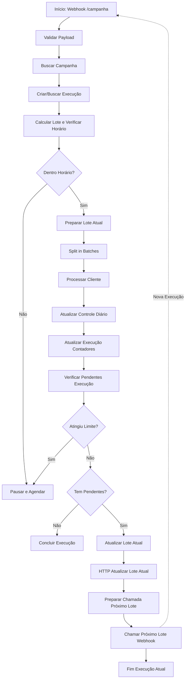

# Guia: Continuação de Lotes via Webhook

## Visão Geral

Este documento descreve como o sistema de campanhas processa múltiplos lotes usando chamadas recursivas ao webhook `/campanha`, garantindo que cada lote seja processado em uma execução separada do N8N.

## Arquitetura

### Fluxo de Processamento de Lotes



## Regras de Atualização da Tabela

### Tabela: `instacar_campanhas_execucoes`

#### Campos Relacionados a Lotes

- **`lote_atual`** (INTEGER): Número do lote atual sendo processado. Incrementa a cada novo lote.
- **`clientes_no_lote_atual`** (INTEGER): Quantidade de clientes no lote atual.
- **`contatos_processados`** (INTEGER): Total de contatos processados até o momento (acumulado).
- **`contatos_pendentes`** (INTEGER): Total de contatos ainda pendentes de processamento.
- **`total_contatos_elegiveis`** (INTEGER): Total de contatos elegíveis para a campanha.
- **`status_execucao`** (TEXT): Status da execução (`em_andamento`, `concluida`, `pausada`, `erro`).

#### Regras de Atualização

1. **Ao Iniciar uma Execução:**
   - Se é a primeira execução do dia, cria registro com `lote_atual = 1`
   - Se é continuação (`continuar: true`), busca execução existente e mantém `lote_atual` atual

2. **Durante o Processamento de um Lote:**
   - `contatos_processados` é incrementado a cada cliente processado
   - `contatos_pendentes` é recalculado: `total_contatos_elegiveis - contatos_processados`
   - `clientes_no_lote_atual` reflete o tamanho do lote atual
   - `status_execucao` permanece como `em_andamento`

3. **Ao Finalizar um Lote (quando há pendentes):**
   - **`lote_atual` é incrementado** no nó "Atualizar Lote Atual"
   - `status_execucao` permanece como `em_andamento`
   - O webhook é chamado para processar o próximo lote

4. **Ao Finalizar TODOS os Lotes:**
   - `status_execucao` é atualizado para `concluida`
   - `horario_fim` é definido com timestamp atual
   - `contatos_pendentes` deve ser 0
   - O webhook **NÃO** é chamado

5. **Ao Pausar (fora de horário ou limite atingido):**
   - `status_execucao` é atualizado para `pausada`
   - `proxima_execucao_em` é definido com timestamp estimado
   - O webhook **NÃO** é chamado (será retomado via cron ou manualmente)

## Nós do Workflow

### Nó: "Atualizar Lote Atual"

**Localização:** Após "IF Tem Pendentes" (quando há pendentes)

**Função:** Incrementa `lote_atual` na execução antes de chamar o próximo lote.

**Código:**
```javascript
// Incrementar lote_atual
const loteAtual = (execucaoData.lote_atual || 1) + 1;

// Preparar body com lote_atual atualizado
const bodyData = {
  lote_atual: loteAtual,
  status_execucao: 'em_andamento'
};
```

### Nó: "HTTP Atualizar Lote Atual"

**Função:** Atualiza o registro de execução no Supabase com o novo `lote_atual`.

**Método:** PATCH
**URL:** `{{SUPABASE_URL}}/rest/v1/instacar_campanhas_execucoes?id=eq.{{execucao_id}}`

### Nó: "Preparar Chamada Próximo Lote"

**Função:** Prepara o payload para chamar o webhook `/campanha` com `continuar: true`.

**Payload:**
```json
{
  "execucao_id": "uuid-da-execucao",
  "campanha_id": "uuid-da-campanha",
  "trigger_tipo": "cron",
  "continuar": true
}
```

### Nó: "Chamar Próximo Lote (Webhook)"

**Função:** Chama o webhook `/campanha` para processar o próximo lote em uma nova execução.

**Método:** POST
**URL:** `{{n8n_webhook_url}}` (obtido de `instacar_configuracoes_sistema.chave = 'n8n_webhook_url'`)

**Importante:** Este nó é o **último** da execução atual. A nova execução será iniciada pelo webhook chamado.

## Validação no Webhook

O nó "Validar Payload" detecta chamadas de continuação através do campo `continuar: true`:

```javascript
const continuar = webhookData.continuar || false;
const execucaoId = webhookData.execucao_id || null;

// Se for continuação, usar execucao_id do payload
if (payload.execucao_id && payload.continuar) {
  return [{
    json: {
      ...campanha,
      execucao_id: payload.execucao_id,
      execucao_existente: true,
      continuar: true
    }
  }];
}
```

## Prevenção de Recursão Profunda

Cada chamada ao webhook gera uma **nova execução independente** no N8N. Isso significa:

- ✅ Não há recursão profunda (cada execução é independente)
- ✅ Cada lote é processado em uma execução separada
- ✅ O N8N gerencia o limite de execuções simultâneas
- ✅ Se uma execução falhar, as outras continuam normalmente

## Queries SQL Úteis

### Verificar Progresso de uma Execução

```sql
SELECT 
  id,
  campanha_id,
  data_execucao,
  lote_atual,
  contatos_processados,
  contatos_pendentes,
  total_contatos_elegiveis,
  status_execucao,
  horario_inicio,
  horario_fim
FROM instacar_campanhas_execucoes
WHERE campanha_id = 'uuid-da-campanha'
  AND data_execucao = CURRENT_DATE
ORDER BY created_at DESC
LIMIT 1;
```

### Calcular Total de Lotes Processados

```sql
SELECT 
  campanha_id,
  data_execucao,
  MAX(lote_atual) as total_lotes_processados,
  contatos_processados,
  total_contatos_elegiveis,
  CASE 
    WHEN contatos_pendentes = 0 THEN 'Concluída'
    WHEN status_execucao = 'pausada' THEN 'Pausada'
    ELSE 'Em Andamento'
  END as status_detalhado
FROM instacar_campanhas_execucoes
WHERE campanha_id = 'uuid-da-campanha'
GROUP BY campanha_id, data_execucao, contatos_processados, total_contatos_elegiveis, contatos_pendentes, status_execucao;
```

### Listar Execuções com Progresso de Lotes

```sql
SELECT 
  c.nome as campanha_nome,
  e.data_execucao,
  e.lote_atual,
  e.contatos_processados,
  e.contatos_pendentes,
  e.total_contatos_elegiveis,
  ROUND((e.contatos_processados::numeric / NULLIF(e.total_contatos_elegiveis, 0)) * 100, 2) as percentual_concluido,
  e.status_execucao,
  e.horario_inicio,
  e.horario_fim
FROM instacar_campanhas_execucoes e
JOIN instacar_campanhas c ON c.id = e.campanha_id
WHERE e.data_execucao >= CURRENT_DATE - INTERVAL '7 days'
ORDER BY e.data_execucao DESC, e.created_at DESC;
```

## Troubleshooting

### Problema: Lote não está sendo incrementado

**Solução:** Verificar se o nó "Atualizar Lote Atual" está sendo executado. Verificar logs do N8N para confirmar que "IF Tem Pendentes" está retornando `true`.

### Problema: Webhook não está sendo chamado

**Solução:** 
1. Verificar se `n8n_webhook_url` está configurado em `instacar_configuracoes_sistema`
2. Verificar se o nó "Preparar Chamada Próximo Lote" está gerando o payload correto
3. Verificar logs do N8N para erros na chamada HTTP

### Problema: Múltiplas execuções simultâneas

**Solução:** Isso é esperado e correto. Cada lote é processado em uma execução separada. O N8N gerencia o limite de execuções simultâneas automaticamente.

### Problema: Execução não marca como concluída

**Solução:** Verificar se `contatos_processados >= total_contatos_elegiveis` no nó "Processar Controle Diário". O status é atualizado automaticamente quando essa condição é verdadeira.

## Melhorias Futuras

1. **Dashboard de Lotes:** Adicionar visualização de progresso por lote na interface web
2. **Métricas de Performance:** Rastrear tempo médio por lote
3. **Alertas:** Notificar quando um lote demora muito para processar
4. **Retry Automático:** Implementar retry automático para lotes que falharam

